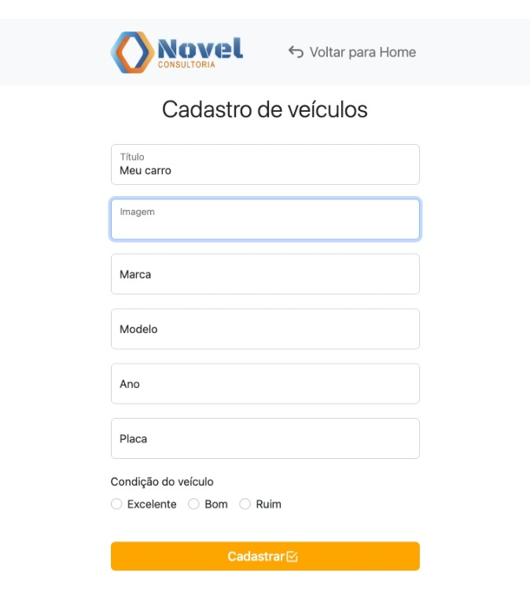
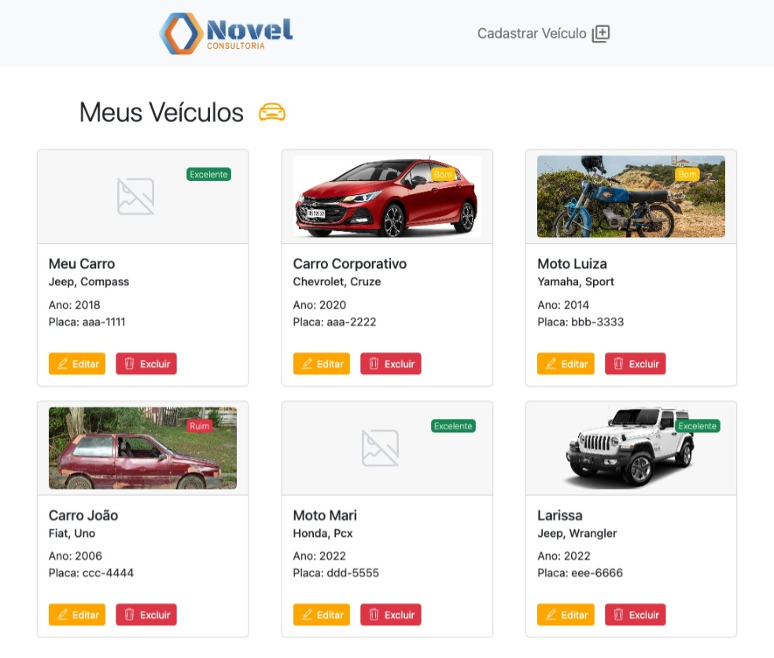
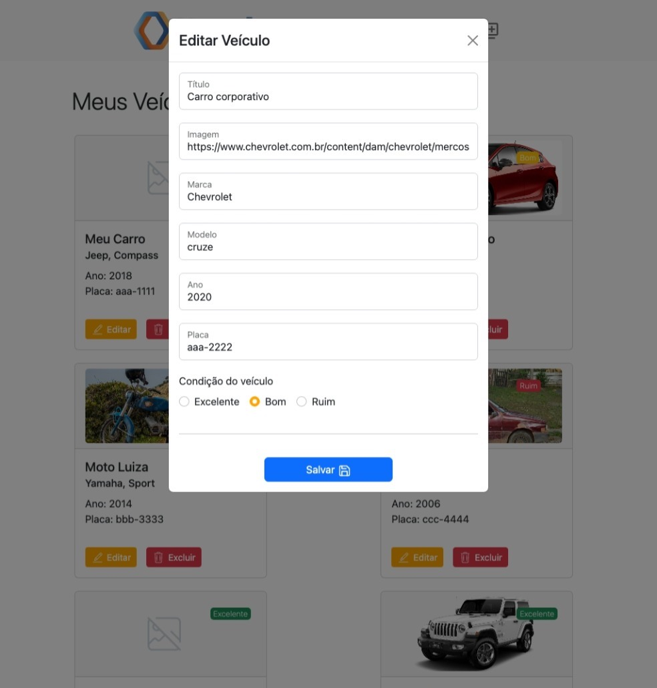

# Aplicação para cadastro de veículos

- aplicação onde é possível cadastrar veículos, visualizar, editar e deletar os veículos cadastrados.
- os dados dos veículos são armazenados no localStorage.

## Dependências

## Instalação

- Faça o clone do projeto para sua máquina: 
  `git clone "nome-do-repositório"`

- Entre na pasta do repositório: 
  `cd teste-tecnico-novel`

- Instale todas as dependências: 
  `yarn`

- Agora o projeto está pronto para rodar: 
  `yarn start`

## Rotas

| Rota                   | Descrição                             |
| ---------------------- | ------------------------------------- |
| /home                  | Visualizar, editar e deletar veículos |
| /vehicles-registration | Cadastro de veículos                  |

## Features

- Cadastro de veículos
  

- Visualização de veículos
  

- Atualização de veículos
  
